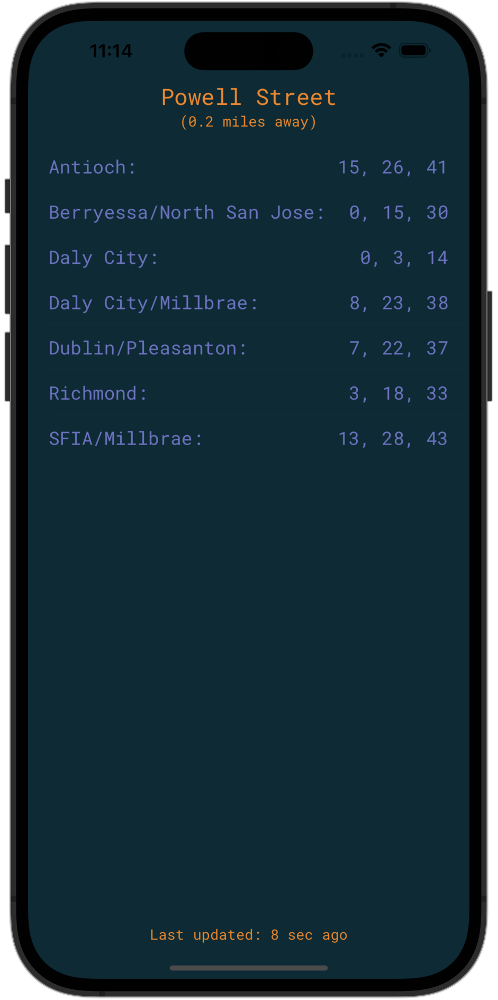

# Poppy

  

Poppy is the transit app for locals. Poppy is the quickest way to know when the next train/bus will depart from the station(s) nearest you.

Poppy does **NOT** tell you how to get where you're going or provide any information other than real-time departures.

For now, Poppy is an experiment and only supports BART in the SF Bay Area.

## How it works

Poppy is an iOS app written in swift which utilizes the [General Transit Feed Specification](https://gtfs.org) via protobuf and  [node-gtfs](https://github.com/BlinkTagInc/node-gtfs) to:

- find the nearest station
- determine the next 3 departures for each route at that station (in minutes)

Schedules updated with a github action which pulls the latest gtfs file and makes a commit if there are changes. This triggers an
app update via Xcode cloud tools.

## Status
Poppy is an experiment, therefore:
- There's not much error handling or testing
- Features are limited

## Contributing

Poppy is open source, I welcome any improvements, especially those which:

- enable quicker time-to-results (e.g. a widget in iOS)
- support multiple transit agencies (e.g. AC Transit, Muni)
- provide better user experience/edge case handling
- provide better data updating
